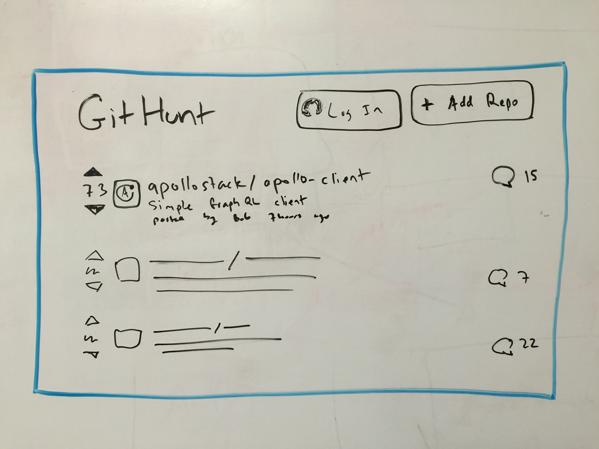

# GitHunt
Concept for an Apollo full-stack example app that demonstrates all of the important concepts

Want to see how it's going? Read the [development log](devlog.md)!

## Code patterns to demonstrate

1. Routes and data loading
1. Server side rendering and store hydration
1. Merging data from multiple backends/APIs
1. Authentication and basic security
1. Mutations - updating and inserting items
1. Developer tool integrations, like `eslint-plugin-graphql`
1. One place where there is reactivity/streaming data (nice to have)

As new patterns emerge in Apollo development, we should add them to this app.

## App concept

GitHunt - like product hunt for GitHub repositories.

There are three views:

1. The home page feed, which is a ranked list of repositories
1. A page to submit a new repository
1. A repository page, with comments

Does it demonstrate all of the required features above?

- [x] Routes and data loading? Yes, it has multiple pages which require different data.
- [x] SSR/hydration? Yes, the front page should load fast.
- [x] Merging data? Yes, this will merge upvote and comment data from a local database with repository information from GitHub.
- [x] Auth and basic security? Yes, it will have GitHub login, and security so that people can only post comments when logged in, and everyone can only vote once per repo.
- [x] Mutations: Submitting a new repo, voting, and commenting.
- [x] Dev tools: Yes
- [x] Reactivity: we can reactively update the vote count on the repository page via a websocket or poll.

## Technology choices

- Apollo server - to put a nice unified API on top of our GitHub and local data
- Apollo client - to load that data declaratively into our UI
- React - it's a great way to build UIs, and has the best integration with Apollo and Redux
- React router - it seems to be the most popular React router today, and has some great hooks and techniques for SSR. It seems like James Baxley has had some success with implementing this stuff already with React Router.
- Webpack - the Meteor build system is by far the most convenient, but comes with a dependency on mongo, its own account system, etc. Since we want to learn how Apollo works without all of these things, we're going to not use it even though it would reduce the complexity of the code.
- Babel - to compile our server code.
- Redux - to manage client side data, perhaps we can also use Redux Form to manage the submission form, but we'll see when we get there.
- Passport.js for login - this seems to be the most common login solution for Express/Node, and has a great GitHub login solution. Jonas has already written a tutorial for using that with GraphQL.
- SQL for local data - We'll use SQLite for dev, and Postgres for production. TBD - should we use Sequelize or some other ORM? Or just Knex for query building?
- Bootstrap for styling - I already know how to use it, and I don't want the styling to be the focus of the app. Let's keep it as simple as possible.

## Page mockup

The front page:

