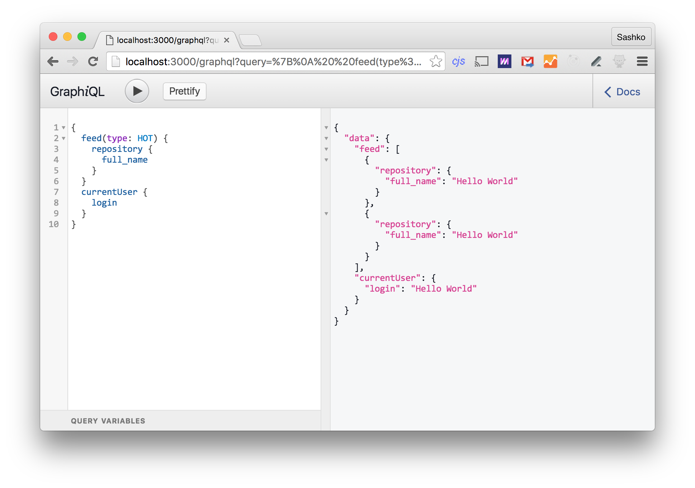
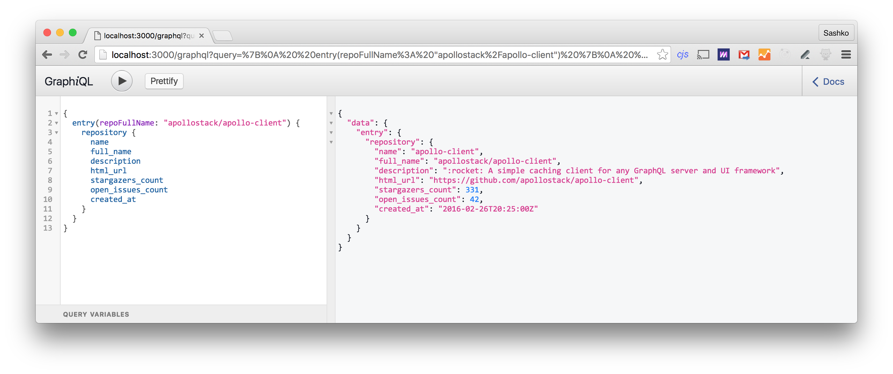
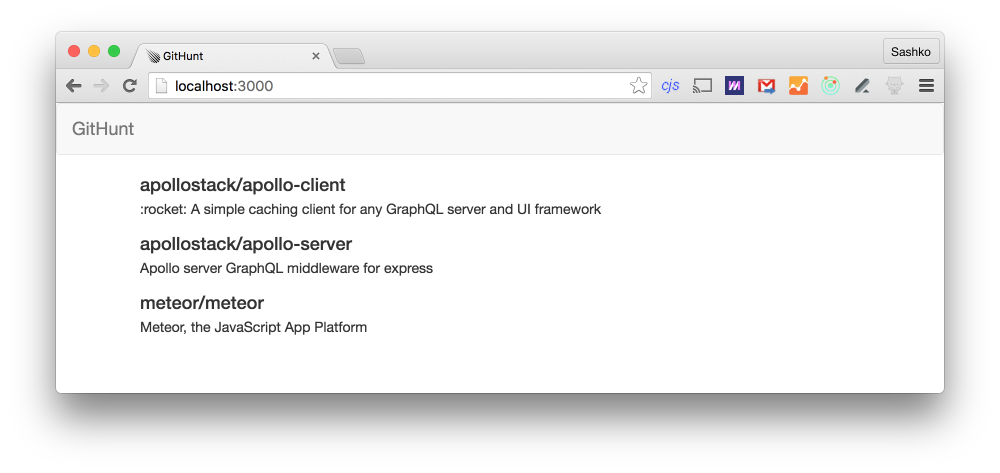
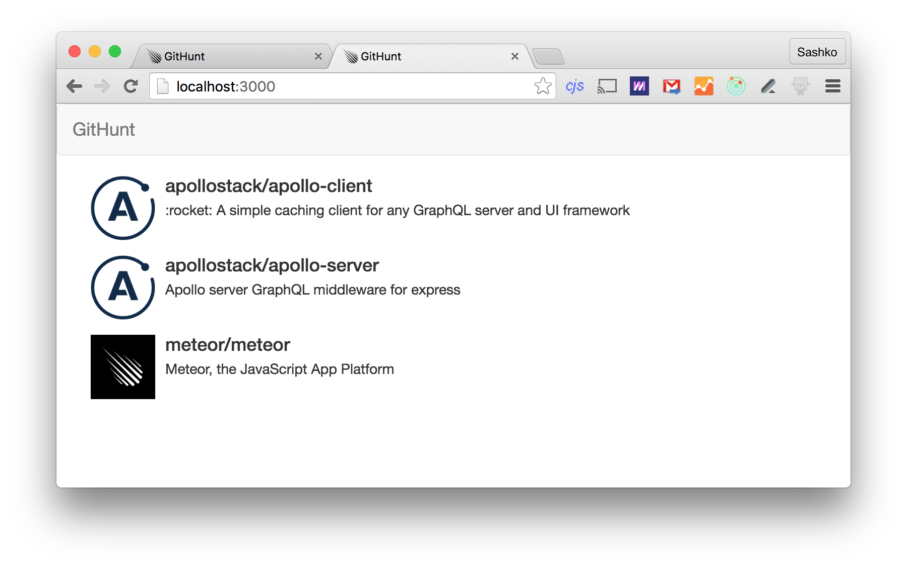
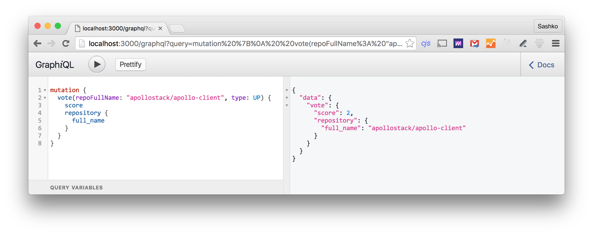
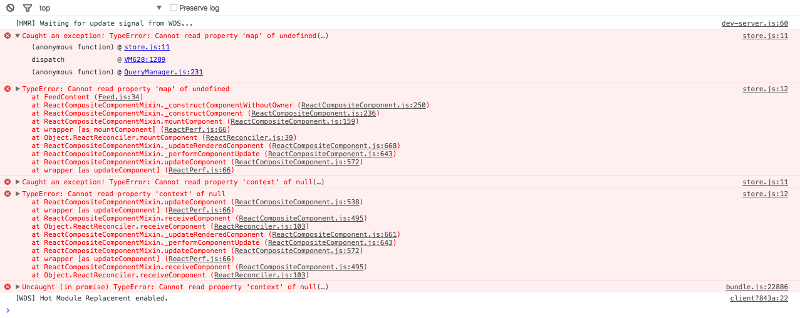
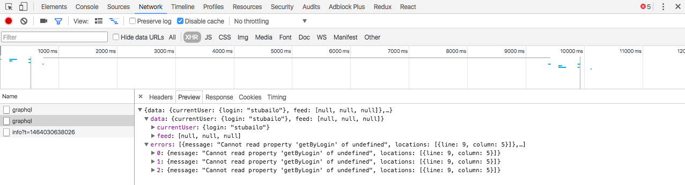

# Development log

All of the steps I'm taking to build this app, from start to finish.

- [Day 1: Concept and tech](#day-1)
- [Day 2: Listing views, schema design, running mock server](#day-2)
- [Day 3: Wiring up the GitHub API](#day-3)

<h3 id="day-1">Day 1: Concept and tech</h3>

It's Friday 5/13, and we have decided to come up with a new example app.

[We wrote down all of the stuff we want to demonstrate about building an app with Apollo.](README.md)

I've also made a list of technology choices, listed in the README:

- Apollo server - to put a nice unified API on top of our GitHub and local data
- Apollo client - to load that data declaratively into our UI
- React - it's a great way to build UIs, and has the best integration with Apollo and Redux
- React router - it seems to be the most popular React router today, and has some great hooks and techniques for SSR. It seems like James Baxley has had some success with implementing this stuff already with React Router.
- Webpack - the Meteor build system is by far the most convenient, but comes with a dependency on mongo, its own account system, etc. Since we want to learn how Apollo works without all of these things, we're going to not use it even though it would reduce the complexity of the code.
- Babel - to compile our server code.
- Redux - to manage client side data, perhaps we can also use Redux Form to manage the submission form, but we'll see when we get there.
- Passport.js for login - this seems to be the most common login solution for Express/Node, and has a great GitHub login solution. Jonas has [already written a tutorial](https://medium.com/apollo-stack/a-guide-to-authentication-in-graphql-e002a4039d1#.l8vt1hskj) for using that with GraphQL.
- SQL for local data - We'll use SQLite for dev, and Postgres for production. TBD - should we use Sequelize or some other ORM? Or just Knex for query building?
- Bootstrap for styling - I already know how to use it, and I don't want the styling to be the focus of the app. Let's keep it as simple as possible.

I drew a [quick mockup of the desired UI](mockup.jpg). It's quite simple, and should be easy to implement in bootstrap.

<h3 id="day-2">Day 2: Listing different views and designing schema</h3>

We want to make this app as simple as possible, but also useful. I think I'll design it the way I would a real app, and then simplify if necessary. Here are some ideas for different views in the app:

- Home page: "Hot" feed, which ranks by number of upvotes and time since posting
- "new" page, which lists stuff that was just posted, but hasn't had time yet to be upvoted
- Submission page, which is a form that lets people put in info about the repository - perhaps it's just a link to the repo, maybe a comment as well?
- Repo page, where you can look at a particular repository, and its upvotes and comments

Given this, let's design our GraphQL schema for the app. I think this is a great place to start the process because it will let us set up some mocked data, and work on the UI and API in parallel as we need to.

#### Repository

This represents a repository on GitHub - all of its data is fetched from the GitHub API. I think it will be convenient to separate data from different APIs into different types in my schema, rather than having one type that merges both the local data (upvotes etc) and the GitHub data (description etc). This can theoretically have [all of the fields that GitHub returns](https://developer.github.com/v3/repos/#get), but we're probably interested mostly in high-level data like:

- Repository name
- Organization/author avatar
- Description
- Number of stars
- Number of issues
- Number of PRs
- Number of contributors
- Date created

#### Entry

This represents a GitHub repository submitted to GitHunt. It will have data specific to our application:

- User that posted this repository
- Date posted
- The related repository object from GitHub
- Display score (probably just upvotes - downvotes)
- Comments
- Number of comments

#### Comment

Just a comment posted on an entry.

- User that posted this comment
- Date posted
- Comment content

#### User

Someone that has logged in to the app.

- Username
- Avatar
- GitHub profile URL

#### In GraphQL schema language

Now let's put it all together to see what our GraphQL schema might look like. Let's keep in mind that this is just a sketch - the mechanics of our app might require some changes.

```graphql
# This uses the exact field names returned by the GitHub API for simplicity
type Repository {
  name: String!
  full_name: String!
  description: String
  html_url: String!
  stargazers_count: Number!
  open_issues_count: Number

  # We should investigate how best to represent dates
  created_at: String!
}

# Uses exact field names from GitHub for simplicity
type User {
  login
  avatar_url
  html_url
}

type Comment {
  postedBy: User!
  createdAt: String! # Actually a date
  content: String!
}

type Entry {
  repository: Repository!
  postedBy: User!
  createdAt: String! # Actually a date
  score: Number!
  comments: [Comment]! # Should this be paginated?
  commentCount: Number!
}
```

Looks pretty good so far! We might also want some root queries as entry points into our data. These are probably going to correlate to the different views we want for our data:

```graphql
# To select the sort order of the feed
enum FeedType {
  HOT
  NEW
}

type Query {
  # For the home page, after arg is optional to get a new page of the feed
  # Pagination TBD - what's the easiest way to have the client handle this?
  feed(type: FeedType!, after: String): [Entry]

  # For the entry page
  entry(repoFullName: String!): Entry

  # To display the current user on the submission page, and the navbar
  currentUser: User
}
```

OK, one last thing - we need to define a few mutations, which will be the way we modify our server-side data. These are basically just all of the actions a user can take in our app:

```graphql
# Type of vote
enum VoteType {
  UP
  DOWN
  CANCEL
}

type Mutation {
  # Submit a new repository
  submitRepository(repoFullName: String!): Entry

  # Vote on a repository
  vote(repoFullName: String!, type: VoteType!): Entry

  # Comment on a repository
  # TBD: Should this return an Entry or just the new Comment?
  comment(repoFullName: String!, content: String!): Entry
}
```

It's not yet clear to me what return values from mutations should be. There are a few possible approaches:

1. Return parent of thing being modified - then we can incorporate the result into the store more easily
2. Return the thing being modified - then we have to figure out where it goes into the store
3. Return the root query object itself, so that we can refetch anything we want after the mutation, in one request

I'd like to try all three eventually and see how they feel in this app. Apollo Client should probably have one or two situations that it deals with the best, so that we can recommend people use that for best results.

#### Getting mocked server running

One great function of Apollo Server is the ability to easily mock data so that you can run some queries against your server without writing any resolvers. Let's get that going.

To do that, we need to set up some build tooling for our server. This would be extra trivial if we used Meteor, but we'll try to go the more generic route and set up babel ourselves. I googled and found this great simple setup: https://github.com/babel/example-node-server

First, let's install some packages:

```txt
npm init
npm install --save-dev nodemon babel-cli babel-preset-es2015 babel-preset-stage-2
```

Let's add a `start` script to our app. We're using `nodemon` so that our app restarts automatically if we change server code.

```js
"scripts": {
  "start": "nodemon index.js --exec babel-node --presets es2015,stage-2"
}
```

Then if we set up some "hello world" index file, we can run `npm start` and confirm that compilation worked.

Let's get Apollo Server going!

```txt
npm install --save express apollo-server
```

Then I massaged the boilerplate from the starter kit: https://github.com/apollostack/apollo-starter-kit

See the code in this commit: https://github.com/apollostack/GitHunt/commit/5f5ad68b28d15139e10d653c1ad24b15535d2706

Now, I have a mocked version of my schema going, after some syntax errors like writing `Number` instead of `Int` in my sketch above. The default mocking just uses `"Hello world!"` for every string so it's not that exciting, but at least it means the server is running properly and the schema is being loaded!



Now there's a decision to make - should we write a mocked backend and then implement the UI, or wire up the actual backend right now?

<h3 id="day-3">Day 3: Wire up GitHub API</h3>

OK, setting up a client build system is a bit annoying - since we can test our server via GraphiQL, let's just use that and connect our schema to a real database.

First, let's split up our schema into multiple files, which correspond to the different models we need to implement in our DB. We are going to follow some of Jonas' recommendations from [the proposed connector spec on GraphQL-Tools](https://github.com/apollostack/graphql-tools/blob/bc7d106cebbb6b03512df7282d4c91f19edb464e/connectors.md). This means we need a few things for our backend:

1. One model for each GraphQL type we want to fetch: Repository, User, Comment, and Entry
2. One connector for each type of backend we are fetching from: GitHub API, and SQL

Probably we want to start from the connectors, because those are more general. We should probably test them in some way. According to the connector document, we want our connectors to definitely do two things:

1. Batching - when we want to fetch multiple objects of the same type, we should batch them into one request if possible (for example, by running a query with an array of IDs, rather than many queries with one ID each)
2. Caching - if we make multiple requests for the same exact object in one query, we should make sure we only do one request if possible and reuse the result. So if we ask for a particular item from the GitHub API, we don't want to fetch it multiple times per request. In our case, we want to implement one more thing in our GitHub connector: ETags and conditional requests, which will let us check the API for changes without running into our rate limit: https://developer.github.com/v3/#conditional-requests

Let's start with the GitHub connector. I think we basically need just one method on the connector:

```
GitHub.getObject(url);
```

Since the GitHub API doesn't support any batching (we can't get multiple repository objects with one request, for example) we can't take advantage of having any more detailed information than the URL in the connector itself. Converting the object type and ID into the URL is something we can do in the model, which will be type-specific.

Let's go over the functionality we want in this connector:

1. It should pass the correct GitHub API key
2. It should not load the same GitHub URL twice in the same request, using something like [DataLoader](https://github.com/facebook/dataloader)
3. It should keep track of `ETag` headers for as many GitHub objects as possible, and send them with requests to both speed up API accesses and avoid hitting the rate limit
4. It doesn't need to send any authentication information other than our API key, because none of the data we are requesting is per-user (although we might want to add this in the future, since the rate limits on the GitHub API are per user)

This means that the connector needs to have both per-request and per-server state - per-request for (1) and per-server for (2). We can make further optimizations later if we end up hitting the GitHub API limit but this seems like a good start.

OK, we implemented a basic connector and tested (1) and (2). (3) is an optimization, so let's wire up the connector and try running some queries before we do that.

Let's implement a simple model layer over our connector - this is going to be the layer that knows about the different kinds of objects we want to fetch, and the URLs for those.

> - NOTE: Following this method, I had to add a bunch of "not implemented" resolvers to my schema right away. Not sure how to overcome that.
> - NOTE: When I get a runtime error in my resolver, GraphiQL shows it to me but I don't get to see where in my server code it actually happened.
> - NOTE: The connectors property on apollo server is misnamed.
> - NOTE: If I wanted to share a connector instance between models, the current API doesn't have a great way to do that since I don't get to call the constructor myself. I feel like I could just attach those to context manually and not be sad about it.

Alright, we've got the GitHub API going!



Next stop is implementing the SQL connector/models, so that we can actually insert some entries into our database.

<h3 id="day-4">Day 4: Setting up SQL</h3>

We want to store our local non-GitHub data in SQL. To do that, we first have to design our SQL schema. It shouldn't be too hard to base this on our GraphQL schema. There are two types that we want to keep in our database:

- Comment
- Entry

To recap, here are the fields they have in the GraphQL schema:

```graphql
type Comment {
  postedBy: User!
  createdAt: String! # Actually a date
  content: String!
}

type Entry {
  repository: Repository!
  postedBy: User!
  createdAt: String! # Actually a date
  score: Int!
  comments: [Comment]! # Should this be paginated?
  commentCount: Int!
}
```

What does that translate to in SQL types? We'll use [SQLite](https://www.sqlite.org/datatype3.html) type names. All should have timestamps and ids, just in case we need them (we're not trying to demo the most optimized SQL schema of all time in this particular app).

- `comments` table
  - `posted_by`: TEXT (GitHub username)
  - `created_at`: INTEGER (Unix time)
  - `content`: TEXT
  - `entry_id`: INTEGER
- `entries` table
  - `repository`: TEXT (GitHub name)
  - `posted_by`: TEXT (GitHub username)
  - `created_at`: INTEGER (Unix time)
- `votes` table (since we need to keep track of who has already upvoted a particular thing)
  - `entry_id`: INTEGER
  - `vote_value`: INTEGER (-1 or +1)
  - `username`: TEXT (GitHub username)

When we get to auth, we might need something to store login tokens as well, but we'll cross that bridge when we get there.

[Here's the current migration code.](https://github.com/apollostack/GitHunt/blob/5ba0136f57d109629c6d2dfcf6a7cfbaeff86517/migrations/20160518201950_create_comments_entries_votes.js)

OK, after messing about with some various Knex and GraphQL stuff, we've also set up some simple seed data, and written some basic resolvers/models. There's still a good way to go until we have a good SQL connector, but we can move on for now. My goal is to get a backend that returns the data we want first, then optimize later.

Also, I found a cool trick to simplify resolvers:

```js
import { property, constant } from 'lodash';

...

createdAt: property('created_at'),
score: constant(0),
commentCount: constant(0),
```

Couldn't help myself: https://medium.com/@stubailo/one-weird-trick-to-make-your-graphql-js-resolvers-more-concise-8cab3072b80#.oolym5t5b

OK, added a few more queries to the SQL model. We don't have caching/batching yet, but we'll implement that when we get there.

### Day 5: Implement basic frontend

OK, I'm now tired of learning SQL, although it was very informative. Let's get that frontend build going and load some data with Apollo Client!

Let's steal the config from [the Graph.Cool example app](https://github.com/graphcool-examples/react-apollo-todo-example).

I learned about the `concurrently` NPM module from the Angular 2 getting started example, so I'm using that to run the webpack dev server and nodemon at the same time, for the server and client builds. I'm also using Webpack dev server `proxy` to pass `/graphql` to my API server.

OK, after fiddling around with a bunch of stuff we now have a basic UI, and no surprises yet!



It's a scientific fact that everything is more exciting with images!



### Day 6: Implement GitHub login

We're going to implement GitHub login. First, let's read Jonas' excellent series on auth in GraphQL ([part 1](https://medium.com/apollo-stack/a-guide-to-authentication-in-graphql-e002a4039d1#.swmmlfyex), [part 2](https://medium.com/apollo-stack/auth-in-graphql-part-2-c6441bcc4302#.4ozv5kdzl)). Based on those ideas, we'll use some of the following libraries:

- [passport](http://passportjs.org/)
- [passport-github](https://github.com/jaredhanson/passport-github)
- [express-session](https://github.com/expressjs/session)
- [connect-session-knex](https://github.com/llambda/connect-session-knex)

Everything was pretty much following the boilerplate in the tutorial and the docs of the various packages (even though I ran into some issues where the docs for the github package were outdated) except one thing:

> NOTE: By default `fetch` doesn't send cookies, and you need to pass the `credentials` option.

Thankfully, passing that option was very easy once I realized I needed it:

```js
const client = new ApolloClient({
  networkInterface: createNetworkInterface('/graphql', {
    credentials: 'same-origin',
  }),
});
```

### Day 7: Add upvote/downvote mutation

OK, we have a pretty good UI going. Next step is to implement our first mutation - `vote`. Let's refresh our memory of what we wrote down before:

```graphql
# Vote on a repository
vote(repoFullName: String!, type: VoteType!): Entry
```

This mutation needs to insert or update a row in our `votes` table, let's remind ourselves what that looks like:

```js
knex.schema.createTable('votes', function (table) {
  table.increments();
  table.timestamps();
  table.integer('entry_id');
  table.integer('vote_value');
  table.string('username');
}),
```

I'm sitting at a coffee shop with Angela Zhang, so I'll ask her since she knows more about SQL things.

Notes from Angela:

1. We might want to have a primary key of (repo id, user id) on votes so that we can use upsert, and quickly find all of the votes for a particular repository.
2. We might want to use GitHub user IDs instead of usernames as the primary key.
3. GitHub warns users a lot about changing their username, so people will expect stuff to break in that case.
4. We can use this SO answer to get the username from a GitHub id if we want to: http://stackoverflow.com/questions/11976393/get-github-username-by-id

Hopefully we can optimize all of this stuff later; for now I'm just going to build something that works.

OK, I implemented the first mutation. The code is absolutely horrible, but it works!



Now let's integrate it into the UI. Fortunately we can start by just copying that into our JS code.

> NOTE: Right now we have a hacky way of reloading the whole UI to display the new vote count. I've filed an issue to improve it, maybe Dhaivat can take a look: https://github.com/apollostack/GitHunt/issues/3

### Day 8: Adding routes, the ability to submit new entries, and more features

> NOTE: It's hard to identify network or GraphQL errors when using react-apollo. It's not that hard to look into the network tab, but I get something like this:



> When what I really want is this:



Alright, let's add some routing to our app. As we mentioned before, we want at least three different routes:

1. Home page/feed
2. Page to add a new entry
3. Page for a specific entry, perhaps with a comment list

Right now, let's just do (1) and (2) - I feel like (3) and implementing comments might be a fair bit of work that we don't need to do at the moment.

We're going to go with React Router for this app, so let's get that set up. We already have `Layout` and `Feed` components that we should just be able to drop into the routes. They'll probably look like this:

```js
// Sketch of code, not guaranteed to work

// Before, no router
render(
  <ApolloProvider client={client}>
    <Layout><Feed /></Layout>
  </ApolloProvider>,
  document.getElementById('root')
)

// After, with routes
render((
  <ApolloProvider client={client}>
    <Router history={browserHistory}>
      <Route path="/" component={Layout}>
        <IndexRoute component={Feed} />
        <Route path="new" component={NewEntry}/>
        <Route path="*" component={NoMatch}/>
      </Route>
    </Router>
  </ApolloProvider>
), document.body)
```

In addition to adding the routes, we need to implement:

1. `NewEntry`, a simple form for adding a new component, and
2. `NoMatch`, basically a 404 page.

Also, this is a good opportunity to add a `new` feed in addition to `top`, which can be driven by query parameters and links in the navbar.
